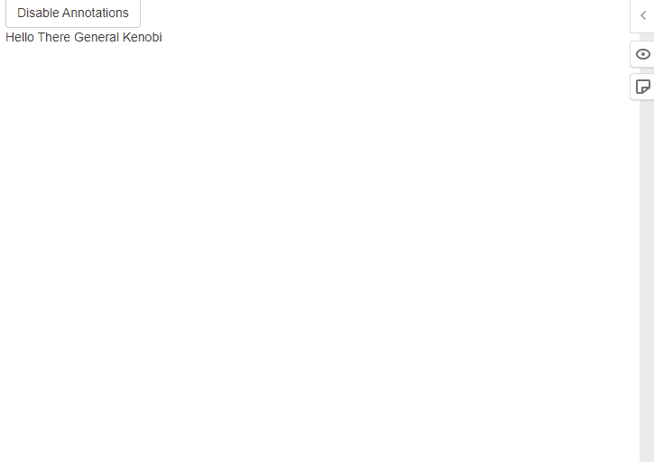

# hypothesis

[](https://github.com/r-world-devs/hypothesis)

## Overview

`hypothesis` R package allows you to add, share and manage annotations
for Shiny applications and R Markdown documents. It is a wrapper of cool
[hypothes.is](https://web.hypothes.is/) tool.



## Installation

``` r
# Latest development version
remotes::install_github("r-world-devs/hypothesis")
```

## Usage

### Shiny

Just call `useHypothesis()` within the app UI.

You can also (optionally) use `hypothesisOnOff` to allow turning
annotations feature on/off with the returned button.

``` r
library(shiny)
library(hypothesis)

ui <- fluidPage(
  useHypothesis(),
  hypothesisOnOff(TRUE),
  br(),
  "Hello There General Kenobi"
)

server <- function(input, output, session) {

}

shinyApp(ui, server)
```

### R Markdown

Just place `useHypothesis()` in document R chunk.

`hypothesisOnOff` work great as well.

<pre>
---
title: "Document"
author: "Author"
date: "9/21/2022"
output: html_document
---

<code>&#96</code><code>&#96</code><code>&#96</code>{r setup, include=FALSE}
library(hypothesis)
knitr::opts_chunk$set(echo = TRUE)
hypothesis::useHypothesIs()
<code>&#96</code><code>&#96</code><code>&#96</code>

<code>&#96</code>r hypothesisOnOff(TRUE)<code>&#96</code>

</pre>

## Development

### Rendering website

1.  Clone gh-pages branch as `docs` folder:

<!-- -->

    git clone -b gh-pages git@github.com:r-world-devs/hypothesis.git docs

2.  Render website `pkgdown::build_site()`.
3.  Move to `docs`, commit and push.

## Getting help

In a case you found any bugs, have feature request or general question
please file an issue at the package
[Github](https://github.com/r-world-devs/hypothesis/issues). You may
also contact the package author directly via email at
<krystian8207@gmail.com>.
